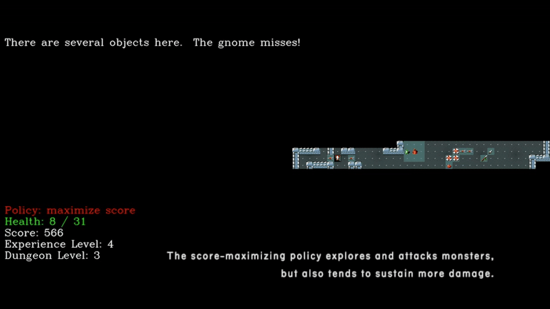

# Scalable Option Learning 

Official implementation of the SOL algorithm described in the paper [Scalable Option Learning in High-Throughput Environments](https://arxiv.org/abs/2509.00338) by [Mikael Henaff](mikaelhenaff.net), [Scott Fujimoto](https://scholar.google.com/citations?user=1Nk3WZoAAAAJ&hl=en), [Michael Matthews](https://www.mtmatthews.com/) and [Michael Rabbat](https://ai.meta.com/people/1148536089838617/michael-rabbat/).

SOL is a highly scalable hierarchical RL algorithm which jointly learns option and controller policies from online interaction. It requires a set of reward functions (one for each option or sub-policy), and will simultaneously learn policies for each one as well as a controller which coordinates them in order to maximize the task reward. Scalability is achieved by representing both both high and low-level policies with a single neural network enabling batched learning, efficient advantage and return computations, and environment wrappers to track option execution. The clip below shows an agent trained on NetHack with options to maximize score and health. 


<p align="center">
  
</p>


## Installation

We provide dependency files which can be used with either `conda` or `pip`. You can install these in a conda env with:

```
conda env create -f environment.yml
```

Or with `pip` with:

```
pip install -r requirements.txt
```

You will also need to compile the rewards computation code to Cython:

```
cd sol
python setup.py build_ext --inplace
```

## Usage

To run any experiment, use the `launch.py` script. This takes as argument a config `.yaml` file specifying all hyperparameters to sweep over. You can add values in a list and it will do a grid search over all combinations of hyperparameters.
The script can be run in dry mode to run locally, and also to submit jobs to a cluster via Slurm. Additionally, there is a `--debug` flag which runs single-threaded locally, so you can use debuggers like `pdb`.

To run single-threaded locally for debugging:

```
python launch.py --expfile exp_configs/{sweep_file}.yaml --mode local --debug
```

To run locally in multi-thread mode (for example, for speed tests):

```
python launch.py --expfile exp_configs/{sweep_file}.yaml --mode local
```

To submit the full sweep to a Slurm cluster:

```
python launch.py --expfile exp_configs/{sweep_file}.yaml --wandb_proj {wandb_project_name} --mode slurm --partition {partition_name} --num_cpus {num_cpus} --seeds 5 --days 3
```

The config files for the experiments in the paper can be found in the `exp_configs` folder. 


## Notes

- In our experiments we patched the NLE to disable changes in luck due to lunar phases and Friday the 13th, [which make reproducibility difficult](https://x.com/CupiaBart/status/1793930355617259811). To do this, you can comment out [these lines](https://github.com/NetHack-LE/nle/blob/a0bf06b5fe51bf24e75b9830d01714ff02d410ed/src/allmain.c#L56-L67) of the source code and set [this function](https://github.com/NetHack-LE/nle/blob/a0bf06b5fe51bf24e75b9830d01714ff02d410ed/src/hacklib.c#L1133) to always return `False`. We also suggest adding this line right above the first commented portion, which will print a message at the start of the game to confirm the change:

```
pline("Patched NetHack without lunar phases and such.");
```

By default, the code will try to import the NLE from an `nle_patched` folder in the main directory. If this does not exist, it will fall back on the standard NLE. 

- The NetHack experiments take a long time to run (~2 weeks), but MiniHack experiments are much faster (<1 day). If you are trying out new hierarchical algorithms, they can provide a quick sanity check.

## Running SOL on new environments

In principle, SOL is applicable to any RL problem for which you can define a set of intrinsic rewards in addition to the task reward. To run on a new environment:

- First integrate the environment in the regular Sample Factory code ([instructions here](https://www.samplefactory.dev/03-customization/custom-environments/)) and make sure it runs with `--with_sol False`. 
- You will need to add two Gymnasium wrappers around your env. The first computes your intrinsic rewards and returns them in the `info` dict under the key `intrinsic_rewards`. That is, in the `step` function do:
```
intrinsic_rewards = {
'reward_1': ...
'reward_2': ...
...
}
info['intrinsic rewards'] = intrinsic_rewards
```
- The second is a HierarchicalWrapper, which requires a few arguments:
```
# these coefficient will scale the intrinsic rewards
# try to set them so all rewards are in roughly similar ranges.
reward_scale = {
'reward_1': 1.0,
'reward_2': 10.0,
...
}

# this specifies what options will be used - there is one option per reward function listed.
# note: it's usually good to include the task reward here,
# so the system can default to a flat policy when needed. 
base_policies = ['reward_1', 'reward_2', 'reward_5']

# this specifies which of the rewards the controller should optimize - i.e. the task reward. 
controller_reward_key = 'reward_2'

# if option_length is positive, options will always execute for this number of steps.
# if set to -1, option length will adaptively be chosen by the controller from {1, 2, 4, ..., 128}.
option_length = -1

env = HierarchicalWrapper(
          env,
          reward_scale,
          base_policies,
          controller_reward_key,
          option_length,
)
```


## Citation

If you use this code, please cite the following:

```
@misc{henaff2025scalableoptionlearninghighthroughput,
      title={Scalable Option Learning in High-Throughput Environments}, 
      author={Mikael Henaff and Scott Fujimoto and Michael Matthews and Michael Rabbat},
      year={2025},
      eprint={2509.00338},
      archivePrefix={arXiv},
      primaryClass={cs.LG},
      url={https://arxiv.org/abs/2509.00338}, 
}
```


## Acknowledgements

We use Alexei Petrenko's excellent [Sample Factory codebase](https://github.com/alex-petrenko/sample-factory) as our base RL algorithm, check it out!

## License

The code portions specific to SOL contained in the `sol/` subfolder are licensed by CC-BY-NC. The original Sample Factory code is licensed under the MIT license. 

