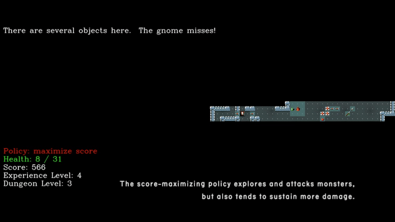

<p align="center">
  <b>Please find SOL at its new home at <a href="https://github.com/mbhenaff/sol">github.com/mbhenaff/sol</a></b>
</p>

# Scalable Option Learning

Official implementation of Scalable Option Learning (SOL) and related algorithms. SOL is a highly scalable hierarchical RL algorithm which jointly learns option and controller policies from online interaction, described in the following paper:

- [Scalable Option Learning in High-Throughput Environments](https://arxiv.org/abs/2509.00338) by [Mikael Henaff](mikaelhenaff.net), [Scott Fujimoto](https://scholar.google.com/citations?user=1Nk3WZoAAAAJ&hl=en), [Michael Matthews](https://www.mtmatthews.com/) and [Michael Rabbat](https://ai.meta.com/people/1148536089838617/michael-rabbat/) (ICML 2026)

The original SOL algorithm requires a set of reward functions (one for each option or sub-policy), and will simultaneously learn policies for each one as well as a controller which coordinates them in order to maximize the task reward. Scalability is achieved by representing both both high and low-level policies with a single neural network enabling batched learning, efficient advantage and return computations, and environment wrappers to track option execution. The clip below shows an agent trained on NetHack with options to maximize score and health. 


<p align="center">
  
</p>


Hierarchical Behaviour Spaces (HBS) parameterizes options by linear combinations over reward functions, rather than having one option per reward. This effectively enables learning a number of options that is combinatorial in the number of reward functions, which is more expressive. HBS is implemented here using SOL's scalable framework. 

- [Hierarchical Behaviour Spaces](https://arxiv.org/abs/2604.24558) by [Michael Matthews](https://www.mtmatthews.com/), [Anssi Kanervisto](https://scholar.google.com/citations?view_op=list_works&hl=en&hl=en&user=iPimqbwAAAAJ), [Jakob Foerster](https://www.jakobfoerster.com/), [Pierluca D'Oro](https://proceduralia.github.io/), [Scott Fujimoto](https://scholar.google.com/citations?user=1Nk3WZoAAAAJ&hl=en) and [Mikael Henaff](mikaelhenaff.net) (RLC 2026)


This repo also contains the updates to the NetHack Learning Environment described in the blog post:

- [Revisiting The NetHack Learning Environment](https://iclr-blogposts.github.io/2026/blog/2026/revisiting-the-nle/) by [Michael Matthews](https://www.mtmatthews.com/), [Anssi Kanervisto](https://scholar.google.com/citations?view_op=list_works&hl=en&hl=en&user=iPimqbwAAAAJ), [Jakob Foerster](https://www.jakobfoerster.com/), [Pierluca D'Oro](https://proceduralia.github.io/), [Scott Fujimoto](https://scholar.google.com/citations?user=1Nk3WZoAAAAJ&hl=en) and [Mikael Henaff](mikaelhenaff.net) (ICLR 2026 Blog Post)


## Installation

We provide dependency files which can be used with either `conda` or `pip`. You can install these in a conda env with:

```
conda env create -f environment.yml
```

Or with `pip` with:

```
pip install -r requirements.txt
```

You will also need to compile the rewards computation code to Cython:

```
cd sample_factory/algo/utils/cython
python setup.py build_ext --inplace
```

To use the patched NLE described below, do: 

```
cd nle_patched
pip install -e .
```

## Usage

To run any experiment, use the `launch.py` script. This takes as argument a config `.yaml` file specifying all hyperparameters to sweep over. You can add values in a list and it will do a grid search over all combinations of hyperparameters.
The script can be run in dry mode to run locally, and also to submit jobs to a cluster via Slurm. Additionally, there is a `--debug` flag which runs single-threaded locally, so you can use debuggers like `pdb`.

To run single-threaded locally for debugging:

```
python launch.py --expfile exp_configs/{sweep_file}.yaml --dry --debug
```

To run locally in multi-thread mode (for example, for speed tests):

```
python launch.py --expfile exp_configs/{sweep_file}.yaml --dry
```

To submit the full sweep to a Slurm cluster:

```
python launch.py --expfile exp_configs/{sweep_file}.yaml --wandb_proj {wandb_project_name} --mode slurm --partition {partition_name} --num_cpus {num_cpus} --seeds 5 --days 3
```

The config files for the experiments in the paper can be found in the `exp_configs` folder.

To use the original version of SOL with one option per reward function, pass the following argument:

```
--sol_controller_action_space discrete
```

To use SOL-HBS, use:

```
--sol_controller_action_space multidiscrete
```


## Notes

- In our experiments we patched the NLE to disable changes in luck due to lunar phases and Friday the 13th, [which make reproducibility difficult](https://x.com/CupiaBart/status/1793930355617259811). To do this, you can comment out [these lines](https://github.com/NetHack-LE/nle/blob/a0bf06b5fe51bf24e75b9830d01714ff02d410ed/src/allmain.c#L56-L67) of the source code and set [this function](https://github.com/NetHack-LE/nle/blob/a0bf06b5fe51bf24e75b9830d01714ff02d410ed/src/hacklib.c#L1133) to always return `False`. We also suggest adding this line right above the first commented portion, which will print a message at the start of the game to confirm the change:

```
pline("Patched NetHack without lunar phases and such.");
```

By default, the code will try to import the NLE from an `nle_patched` folder in the main directory. If this does not exist, it will fall back on the standard NLE. 

- The NetHack experiments take a long time to run (~2 weeks), but MiniHack experiments are much faster (<1 day). If you are trying out new hierarchical algorithms, they can provide a quick sanity check.

## Running SOL on new environments

In principle, SOL is applicable to any RL problem for which you can define a set of intrinsic rewards in addition to the task reward. To run on a new environment:

- First integrate the environment in the regular Sample Factory code ([instructions here](https://www.samplefactory.dev/03-customization/custom-environments/)) and make sure it runs with `--with_sol False`. 
- You will need to add two Gymnasium wrappers around your env. The first computes your intrinsic rewards and returns them in the `info` dict under the key `intrinsic_rewards`. That is, in the `step` function do:
```
intrinsic_rewards = {
'reward_1': ...
'reward_2': ...
...
}
info['intrinsic rewards'] = intrinsic_rewards
```
- The second is a HierarchicalWrapper, which requires a few arguments:
```
# these coefficient will scale the intrinsic rewards
# try to set them so all rewards are in roughly similar ranges.
reward_scale = {
'reward_1': 1.0,
'reward_2': 10.0,
...
}

# this specifies what options will be used - there is one option per reward function listed.
# note: it's usually good to include the task reward here,
# so the system can default to a flat policy when needed. 
base_policies = ['reward_1', 'reward_2', 'reward_5']

# this specifies which of the rewards the controller should optimize - i.e. the task reward. 
controller_reward_key = 'reward_2'

# if option_length is positive, options will always execute for this number of steps.
# if set to -1, option length will adaptively be chosen by the controller from {1, 2, 4, ..., 128}.
option_length = -1

env = HierarchicalWrapper(
          env,
          reward_scale,
          base_policies,
          controller_reward_key,
          option_length,
)
```


## Citation

If you use this code, please cite the relevant papers:

```
@misc{henaff2025scalableoptionlearninghighthroughput,
      title={Scalable Option Learning in High-Throughput Environments}, 
      author={Mikael Henaff and Scott Fujimoto and Michael Matthews and Michael Rabbat},
      year={2025},
      eprint={2509.00338},
      archivePrefix={arXiv},
      primaryClass={cs.LG},
      url={https://arxiv.org/abs/2509.00338}, 
}

@misc{matthews2026hierarchicalbehaviourspaces,
      title={Hierarchical Behaviour Spaces}, 
      author={Michael Tryfan Matthews and Anssi Kanervisto and Jakob Foerster and Pierluca D'Oro and Scott Fujimoto and Mikael Henaff},
      year={2026},
      eprint={2604.24558},
      archivePrefix={arXiv},
      primaryClass={cs.AI},
      url={https://arxiv.org/abs/2604.24558}, 
}

@inproceedings{matthews2026revisitingthenethack,
  author = {Matthews, Michael and D'Oro, Pierluca and Kanervisto, Anssi and Fujimoto, Scott and Foerster, Jakob and Henaff, Mikael},
  title = {Revisiting The NetHack Learning Environment},
  booktitle = {ICLR Blogposts 2026},
  year = {2026},
  date = {April 27, 2026},
  note = {https://iclr-blogposts.github.io/2026/blog/2026/revisiting-the-nle/},
  url  = {https://iclr-blogposts.github.io/2026/blog/2026/revisiting-the-nle/}
}
```


## Acknowledgements

We use Alexei Petrenko's excellent [Sample Factory codebase](https://github.com/alex-petrenko/sample-factory) as our base RL algorithm, check it out!

## License

The code portions specific to SOL are licensed by CC-BY-NC. The original Sample Factory code is licensed under the MIT license. 